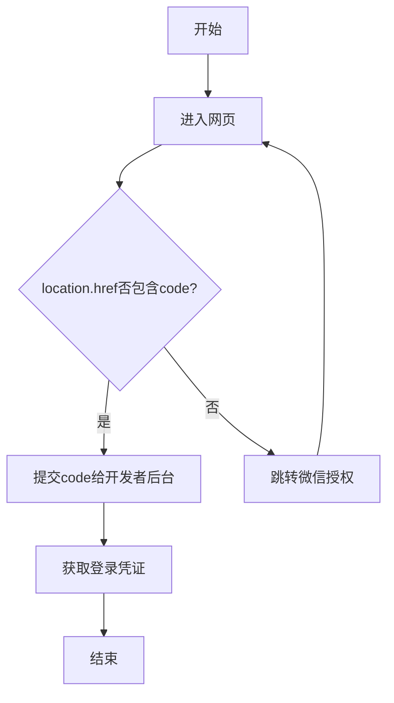

# 微信登录授权处理

参考[公众号网页授权](https://developers.weixin.qq.com/doc/offiaccount/OA_Web_Apps/Wechat_webpage_authorization.html)



> react 项目为例

```tsx title="main.tsx"
import React from 'react'
import ReactDOM from 'react-dom/client'
import App from './App.tsx'
import { getTokenCookie } from './utils/cookie.ts'
import { wxAuth } from './utils/wx'

/**
 * init app
 */
function renderApp() {
  ReactDOM.createRoot(document.getElementById('root')!).render(
    /**
     * do not remove StrictMode it will cause error
     * @see https://react.dev/reference/react/StrictMode
     */
    <React.StrictMode>
      <App />
    </React.StrictMode>,
  )
}

/**
 * init wx auth
 */
function handleWxAuthorization() {
  const url = new URL(window.location.href)
  const code = url.searchParams.get('code')
  if (code) {
    try {
      renderApp()
    }
    catch (error) {
      console.error('微信登录失败:', error)
      wxAuth() // 失败时重新引导授权
    }
  }
  else {
    wxAuth()
  }
}

/**
 * init
 */
async function init() {
  if (getTokenCookie()) {
    renderApp()
  }
  else {
    handleWxAuthorization()
  }
}

init()
```

```ts title="./utils/wx.ts"
/**
 * @description 微信授权
 */
export function wxAuth() {
  // 当前地址
  const currentUrl = new URL(window.location.href)
  // 参数
  const state = currentUrl.searchParams.get('state') ?? 'state'

  const appid = import.meta.env.VITE_APP_WX_APP_ID

  const redirect_uri = currentUrl.href

  const wxAuthUrl = new URL('https://open.weixin.qq.com/connect/oauth2/authorize')
  wxAuthUrl.searchParams.set('appid', appid)
  wxAuthUrl.searchParams.set('redirect_uri', redirect_uri)
  wxAuthUrl.searchParams.set('response_type', 'code')
  wxAuthUrl.searchParams.set('scope', 'snsapi_userinfo')
  wxAuthUrl.searchParams.set('state', state)
  wxAuthUrl.hash = 'wechat_redirect'
  window.location.href = wxAuthUrl.href
}
```
